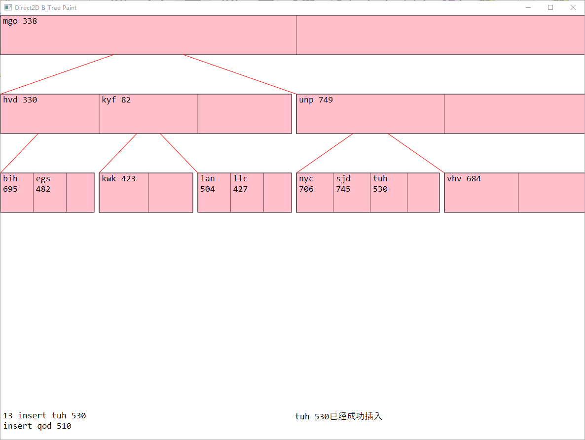

# B_TreeDisplay
使用direct2d简单实现的绘制b树形态，用于展示用。由于老师需要学生实现可以展示b树形态的程序，于是通过阅读msdn的direct2d start实例简单的撸了个简易的b树绘制展示程序。
## 环境说明
使用vs2017.使用了direct2d.  
需要在vs2017的环境配置中【项目属性】【链接器】【输入】【附加依赖项】中增添

	d2d1.lib  
	dwrite.lib  
## 运行说明
已经将release版本的`Direct2dQuickStart.exe`上传  
双击即可运行。  
程序会自动从input.txt中读取操作命令。  
### 操作说明  

|操作|功能|
|--|--|
|鼠标右击|执行一个操作|
|点击右上角x|程序终止执行|

### 截图
  
